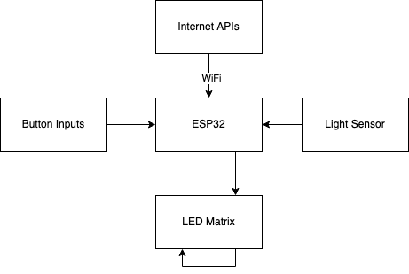

# What hardware does this use?
- Aliexpress 64x32 RGB LED Matrix
- ESP32 DevKit
- Headways Departures PCB and all related components
- 5 volt power supply capable of at least 3 amps. 
- 3D printed case
- Some wire

# How does it work?
The ESP32 DevKit is the brains of the entire operation. It contains the WiFi module and main processor. It communicates with internet services over WiFi, and it receives input from the buttons and light sensor. It outputs data to the LED matrix using 8 connections. 

The Departures PCB handles all this mess of wires for you, although it does require some simple wiring to connect to the daughter board that plugs into the other side of the matrix. 

# Why does the LED Matrix connect back into itself?
The matrix is designed so that you can clock in data for each color simultaneously. It is also designed to be chained, so once a color packet makes it all the way through, it comes out the other side. To save on pins, and since we are only driving one or two displays, there is no need to clock data in in parallel. So instead, the data coming out is fed back into the input. This allows us to save on pins at the expense of update time, which is no big deal since that only becomes an issue at much larger scales. 

# How is the WiFi connection established? 
Upon initial startup, the device will host its own WiFi network entitled "bus good." Connect to this network with your smart phone or laptop and you should be guided through the setup process. The setup process asks for a username and pin, which the device will use to connect to our online configuration service to pull your configuration.